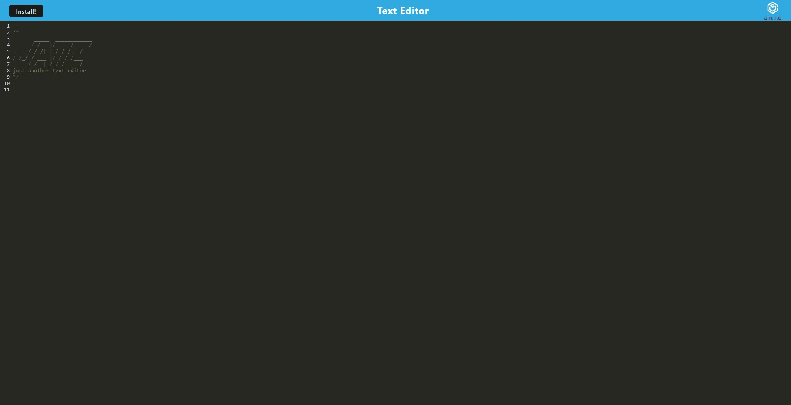
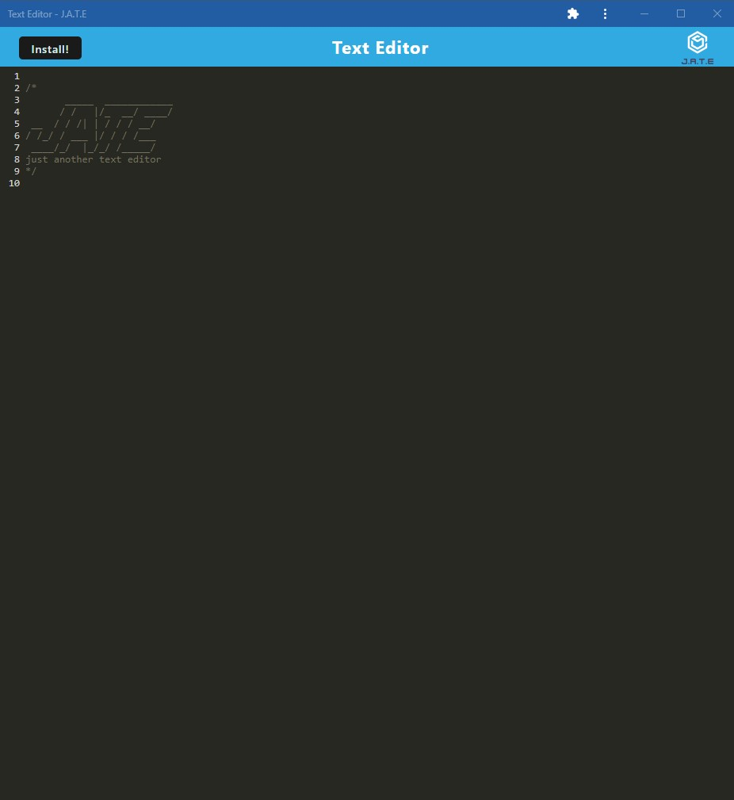

# PWA: Text Editor

Visit my website to use the app!

https://pacific-springs-79381-b19ae67e552f.herokuapp.com/

## Description

Whether it is opening a Google Doc or a simple Notepad, users like to write down their thoughts and ideas. With this text editor application, users can conveniently edit text from their local machines by downloading this application onto their device. With this being my first application that can actually be downloaded, it has taught me a lot about what goes into being able to install other kinds of applications that do not need a web browser to function.

## Installation and Usage

After opening the application, click on the 'Install' button to download the app to your device:

Once you have installed and opened the application on your device, here is how it will appear:

## License

MIT License